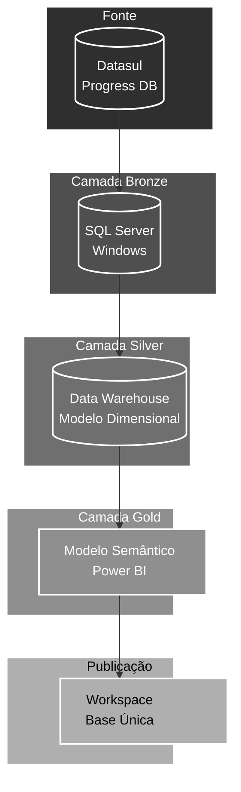

# Nexus Ligas - Arquitetura de Dados Power BI

## Documentação por Camada

### [📁 Fonte (Datasul)](source.md)
- Origem dos dados transacionais
- Estrutura de tabelas TOTVS
- Periodicidade de atualização
- Gestão de conexões

### [📁 Bronze (SQL Server)](bronze.md)
- Réplica dos dados Datasul
- Estrutura normalizada
- Processos de ETL
- Controle de qualidade

### [📁 Silver (Data Warehouse)](silver.md)
- Modelo dimensional
- Star schemas
- Histórico e snapshots
- Processos de transformação

### [📁 Gold (Semantic Model)](gold.md)
- Modelo semântico Power BI
- Medidas e KPIs
- Relacionamentos
- Otimização de performance

### [📁 Publicação (Workspace)](publish.md)
- Ambientes (DEV/PRD)
- Políticas de atualização
- Segurança e acessos
- Monitoramento
