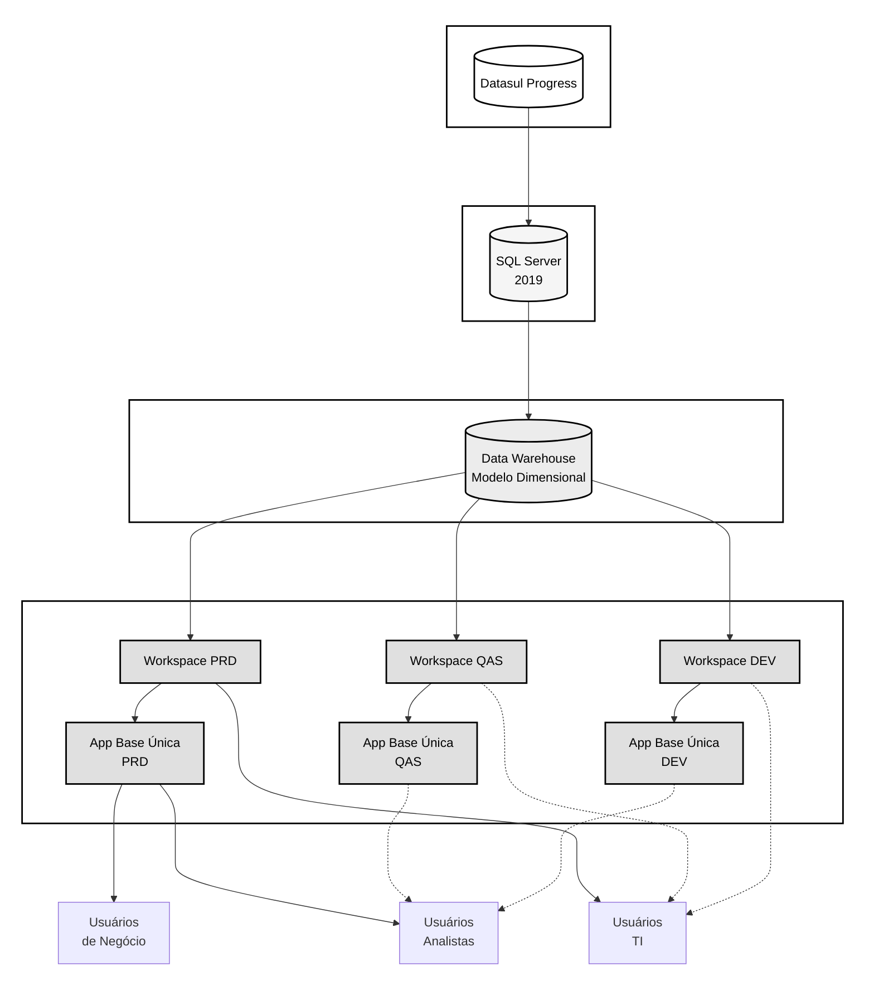

# Nexus Ligas - Governança Power BI

## Sumário da Documentação

- [Arquitetura de Dados](architecture/README.md)
  - [Fonte de Dados](source.md)
  - [Camada Bronze](bronze.md)
  - [Camada Silver](silver.md)
  - [Camada Gold](gold.md)
  - [Publicação](publish.md)
- [Requisitos](requirements/README.md)
- [User Stories](user%20stories/README.md)

## Arquitetura de Dados

## Papéis e Responsabilidades

### TI (Tecnologia da Informação)
- Gestão da infraestrutura
- Manutenção da camada bronze (SQL Server)
- Monitoramento de performance
- Gestão de acessos e segurança
- Backup e disaster recovery

### Analistas de Dados
- Desenvolvimento dos modelos dimensionais (Silver)
- Criação e manutenção do modelo semântico (Gold)
- Desenvolvimento de relatórios e dashboards
- Documentação técnica
- Suporte aos usuários de negócio

### Usuários de Negócio
- Consumo dos relatórios via App
- Validação das regras de negócio
- Solicitação de novos desenvolvimentos
- Feedback sobre usabilidade
- Participação nas homologações

## Template Padrão

### Elementos Visuais
- Logotipo Nexus Ligas (superior esquerdo)
- Marca d'água corporativa
- Cores principais:
  * Roxo: #9932cc
  * Laranja: #ffa500

### Layout de Página
- Header fixo com:
  * Logo
  * Título do relatório
  * Data atualização
- Área de filtros (slicers):
  * Data/Período
  * Centro/Planta
  * Produto/Material
  * Outros contextuais
- Área principal de visualizações
- Rodapé com informações de versão

### Navegação
- Menu lateral consistente
- Botões de navegação padronizados
- Drill-through configurado
- Tooltips informativos

## Fluxo de Desenvolvimento

1. **Solicitação**
   - Template de requisição
   - Aprovação do gestor
   - Priorização

2. **Desenvolvimento**
   - Ambiente de desenvolvimento
   - Testes unitários
   - Documentação

3. **Homologação**
   - Validação com usuários
   - Ajustes necessários
   - Aprovação formal

4. **Publicação**
   - Workspace de produção
   - Atualização do App
   - Comunicação aos usuários

## Boas Práticas

### Nomenclatura
- Tabelas: F_ (fatos) e D_ (dimensões)
- Medidas: [med]NomeMedida
- Colunas calculadas: [cc]NomeColuna

### Performance
- Modo Import preferencial
- Direct Query quando necessário
- Refresh incremental configurado
- Particionamento adequado

### Segurança
- RLS (Row Level Security) implementado
- Grupos de segurança AD
- Classificação de dados
- Auditoria ativa

## Suporte e Manutenção

### Níveis de Suporte
1. Autoajuda (documentação)
2. Suporte N1 (analistas)
3. Suporte N2 (TI)

### SLAs
- Criticidade Alta: 4h
- Criticidade Média: 8h
- Criticidade Baixa: 24h