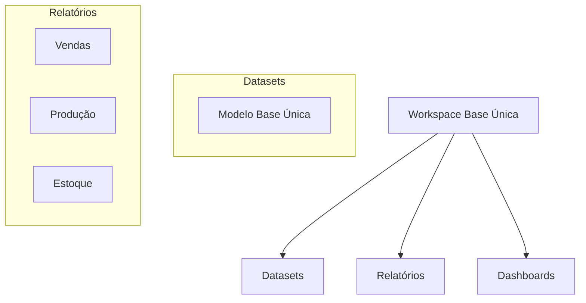

# Publicação (Workspace)

## Objetivo
Gerenciar a publicação e distribuição dos relatórios Power BI.

## Ambientes
- Desenvolvimento (DEV)
- Homologação (HML)
- Produção (PRD)

## Workspace Structure

## Atualização
- Schedule: 8 vezes ao dia
- Horários: 1/1 hora das 6h às 22h
- Monitoramento: Power BI Admin
- Falhas: Alerta via email

## Segurança
- Workspace Roles
  * Admins (Time BI)
  * Members (Desenvolvedores)
  * Contributors (Power Users)
  * Viewers (Usuários)

- Row Level Security (RLS)
  * Por centro
  * Por área
  * Por função

## Template
- Cores corporativas
  * Roxo: #9932cc
  * Laranja: #ffa500
- Logo padrão
- Marca d'água
- Layout consistente

## Governança
- Versionamento
- Documentação
- Certificação
- Auditoria de uso

## Responsáveis
- Administradores Power BI
- Time BI
- Service Desk