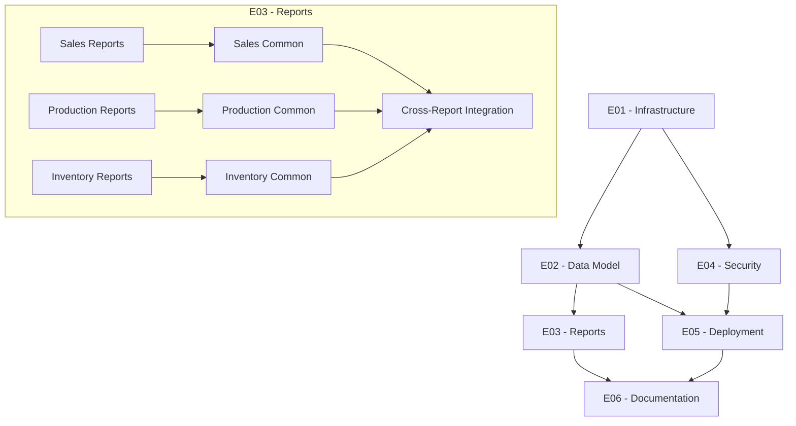

# Product Backlog - Power BI Governance Nexus

[Previous content remains the same until E03 - Report Development section, which gets updated]

### E03 - Report Development
Priority: Medium
Status: Not Started

#### User Stories - Core Reports
See detailed stories in [report_stories.md](report_stories.md)

##### Sales Reports
- [ ] US016 - Sales Performance Dashboard
- [ ] US017 - Sales Pipeline Analysis
- [ ] US018 - Customer Analysis Dashboard

##### Production Reports
- [ ] US019 - Production Performance Dashboard
- [ ] US020 - Quality Control Dashboard
- [ ] US021 - Production Planning Dashboard

##### Inventory Reports
- [ ] US022 - Inventory Overview Dashboard
- [ ] US023 - Material Requirements Dashboard
- [ ] US024 - Warehouse Operations Dashboard

[Rest of the previous content remains the same]

## Updated Dependencies

[Rest of the content remains the same]

## Change Log

| Date       | Version | Changes                          |
|------------|---------|----------------------------------|
| 2024-01-08 | 1.0     | Initial backlog creation        |
| 2024-01-08 | 1.1     | Added detailed user stories     |
| 2024-01-08 | 1.2     | Added success criteria and KPIs |
| 2024-01-08 | 1.3     | Added detailed report stories   |