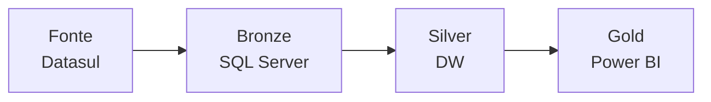

# Arquitetura de Dados - Power BI

Este documento detalha a arquitetura de dados implementada para os relatórios Power BI da Nexus Ligas.

## Visão Geral

A arquitetura segue o modelo de camadas (Medalhas), garantindo governança, rastreabilidade e performance dos dados:

## Estrutura dos Diretórios

- [Fonte de Dados](source.md) - Documentação do Datasul Progress e suas estruturas
- [Camada Bronze](bronze.md) - Detalhes da camada de ingestão SQL Server
- [Camada Silver](silver.md) - Documentação do Data Warehouse
- [Camada Gold](gold.md) - Modelos semânticos do Power BI
- [Publicação](publish.md) - Processo de publicação e ambientes

## Camadas da Arquitetura

### Fonte (Datasul Progress)
- Sistema fonte Datasul ERP
- Localização: SRV-PROGRESS-01
- Tabelas operacionais do ERP
- Dados transacionais

### Bronze (SQL Server)
- Servidor: SRV-SQLSERVER-01
- SQL Server 2019
- Espelho das tabelas fonte
- Dados brutos sem transformação
- Processo de ingestão via CDC

### Silver (Data Warehouse)
- Localização: [TBD]
- Modelo dimensional (Star Schema)
- Tabelas Fato e Dimensão
- Dados transformados e tratados
- Regras de negócio aplicadas

### Gold (Power BI)
- Power BI Service (cloud)
- Ambientes segregados:
  - DEV: Desenvolvimento e testes
  - QAS: Homologação com usuários
  - PRD: Ambiente produtivo
- Apps Base Única por ambiente
- Workspaces com controle de acesso

## Fluxo de Dados

1. **Extração (Fonte → Bronze)**
   - CDC (Change Data Capture) do Progress
   - Cópia full/incremental das tabelas
   - Load histórico preservado

2. **Transformação (Bronze → Silver)**
   - Limpeza e padronização
   - Aplicação do modelo dimensional
   - Criação de dimensões conformadas
   - Agregações e cálculos

3. **Disponibilização (Silver → Gold)**
   - Criação dos modelos semânticos
   - Implementação de medidas
   - Otimização de performance
   - Publicação nos workspaces

## Controle de Acesso

- **Fonte**: Acesso restrito à equipe de DBAs
- **Bronze**: Acesso de leitura para time de dados
- **Silver**: Acesso total para analistas de dados
- **Gold**: 
  - Workspaces: Time de TI e analistas
  - Apps: Usuários de negócio (PRD)
  - DEV/QAS: Restrito a desenvolvedores

## Monitoramento

- Logs de execução em cada camada
- Alertas de falha configurados
- Dashboard de monitoramento
- Métricas de performance
- Auditoria de acessos

## Backup e Recuperação

- **Fonte**: Política do Datasul
- **Bronze**: Backup full diário
- **Silver**: Backup full + diferencial
- **Gold**: 
  - Versionamento dos modelos
  - Backup dos workspaces
  - Retenção de 30 dias

## Links Úteis

- [Governança Power BI](../nxs-governance-pbi.md)
- [Requisitos](../requirements/README.md)
- [User Stories](../user%20stories/README.md)