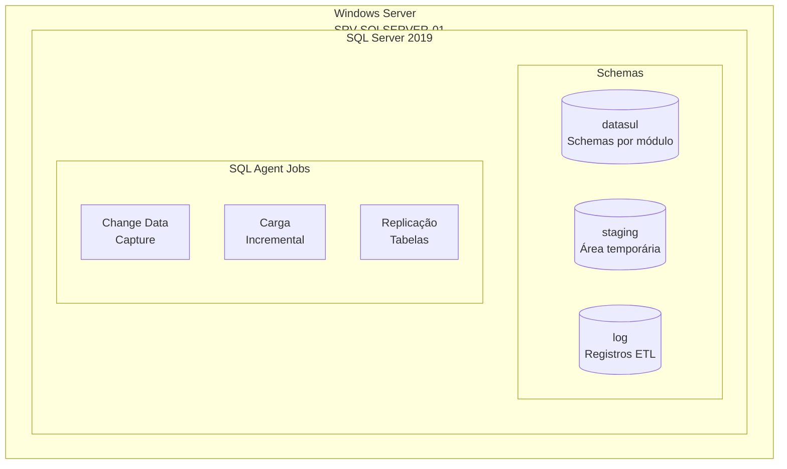

# Camada Bronze - SQL Server

## Visão Geral

A camada Bronze é implementada em SQL Server 2019 e serve como primeira camada de persistência dos dados do Datasul. Esta camada mantém uma cópia espelhada das estruturas originais, preservando os dados brutos sem transformações significativas.



## Infraestrutura

### Servidor
- **Nome**: SRV-SQLSERVER-01
- **Sistema Operacional**: Windows Server 2019
- **CPU**: 16 cores
- **Memória**: 64GB
- **Armazenamento**:
  * Dados: 2TB (RAID 10)
  * Logs: 500GB (RAID 1)
  * Backup: 4TB (RAID 5)

### SQL Server
- **Versão**: SQL Server 2019 Enterprise
- **Atualização**: CU18
- **Collation**: Latin1_General_CI_AS
- **Authentication**: Windows + SQL
- **Porta**: 1433

## Estrutura de Schemas

### datasul
Schema principal que mantém as tabelas espelho do Progress.

```sql
-- Exemplo de criação de schema e permissões
CREATE SCHEMA datasul;
GO

GRANT SELECT ON SCHEMA::datasul TO role_bi_readers;
GRANT SELECT, INSERT, UPDATE, DELETE ON SCHEMA::datasul TO role_etl_users;
```

### staging
Área temporária para processamento de dados.

```sql
CREATE SCHEMA staging;
GO

GRANT SELECT, INSERT, UPDATE, DELETE ON SCHEMA::staging TO role_etl_users;
```

### log
Registro de execuções e auditoria.

```sql
CREATE SCHEMA log;
GO

GRANT SELECT, INSERT ON SCHEMA::log TO role_etl_users;
```

## Tabelas Principais

### Manufatura
```sql
-- Ordens de Produção
CREATE TABLE datasul.mfg_ordem_producao (
    num_ordem INT NOT NULL,
    data_emissao DATE NOT NULL,
    cod_produto VARCHAR(20) NOT NULL,
    quantidade DECIMAL(18,4) NOT NULL,
    data_inicio DATE,
    data_fim DATE,
    status INT NOT NULL,
    lote VARCHAR(20),
    observacao VARCHAR(1000),
    usuario_emissor VARCHAR(50),
    data_alteracao DATETIME,
    data_carga DATETIME DEFAULT GETDATE(),
    CONSTRAINT PK_mfg_ordem_producao PRIMARY KEY (num_ordem)
);

-- Índices
CREATE INDEX IX_mfg_ordem_producao_produto 
ON datasul.mfg_ordem_producao(cod_produto);

CREATE INDEX IX_mfg_ordem_producao_datas 
ON datasul.mfg_ordem_producao(data_emissao, data_inicio, data_fim);
```

### Estoque
```sql
-- Movimentação de Estoque
CREATE TABLE datasul.est_movimento (
    num_movimento BIGINT NOT NULL,
    data_movimento DATETIME NOT NULL,
    cod_produto VARCHAR(20) NOT NULL,
    cod_deposito INT NOT NULL,
    quantidade DECIMAL(18,4) NOT NULL,
    tipo_movimento CHAR(1) NOT NULL, -- E: Entrada, S: Saída
    documento_origem VARCHAR(20),
    tipo_documento VARCHAR(10),
    usuario VARCHAR(50),
    data_registro DATETIME,
    custo_medio DECIMAL(18,6),
    custo_ultimo DECIMAL(18,6),
    data_carga DATETIME DEFAULT GETDATE(),
    CONSTRAINT PK_est_movimento PRIMARY KEY (num_movimento)
);

-- Índices
CREATE INDEX IX_est_movimento_produto 
ON datasul.est_movimento(cod_produto, data_movimento);

CREATE INDEX IX_est_movimento_deposito 
ON datasul.est_movimento(cod_deposito, data_movimento);
```

## Jobs de Carga

### Change Data Capture
```sql
-- Configuração CDC
EXEC sys.sp_cdc_enable_db;
GO

-- Habilitar CDC para tabela específica
EXEC sys.sp_cdc_enable_table
    @source_schema = 'datasul',
    @source_name = 'est_movimento',
    @role_name = 'role_etl_users';
GO
```

### Carga Incremental
```sql
-- Exemplo de job de carga incremental
CREATE PROCEDURE etl.sp_carga_incremental
    @tabela VARCHAR(100),
    @data_inicio DATETIME
AS
BEGIN
    SET NOCOUNT ON;
    
    INSERT INTO log.execucao_etl (
        tabela,
        data_inicio,
        registros_processados
    )
    SELECT 
        @tabela,
        GETDATE(),
        @@ROWCOUNT;
END;
```

## Monitoramento

### Registro de Execuções
```sql
CREATE TABLE log.execucao_etl (
    id BIGINT IDENTITY(1,1),
    tabela VARCHAR(100),
    data_inicio DATETIME,
    data_fim DATETIME,
    status VARCHAR(20),
    registros_processados INT,
    erro_mensagem VARCHAR(MAX),
    CONSTRAINT PK_execucao_etl PRIMARY KEY (id)
);
```

### Métricas de Performance
```sql
CREATE VIEW monitor.vw_metricas_carga AS
SELECT 
    tabela,
    COUNT(*) as total_execucoes,
    AVG(DATEDIFF(SECOND, data_inicio, data_fim)) as tempo_medio_segundos,
    SUM(registros_processados) as total_registros,
    MAX(data_inicio) as ultima_execucao
FROM log.execucao_etl
GROUP BY tabela;
```

## Políticas de Retenção

### Dados
- Retenção padrão: 24 meses
- Dados críticos: 60 meses
- Staging: 7 dias

### Logs
- Logs de execução: 90 dias
- Logs de erro: 180 dias
- Logs de auditoria: 12 meses

```sql
-- Exemplo de cleanup job
CREATE PROCEDURE maintenance.sp_cleanup_logs
AS
BEGIN
    -- Limpar logs antigos
    DELETE FROM log.execucao_etl
    WHERE data_inicio < DATEADD(DAY, -90, GETDATE());
    
    -- Limpar staging
    TRUNCATE TABLE staging.temp_movimentos;
END;
```

## Links Relacionados
- [Fonte de Dados](source.md)
- [Camada Silver](silver.md)
- [Governança](../nxs-governance-pbi.md)