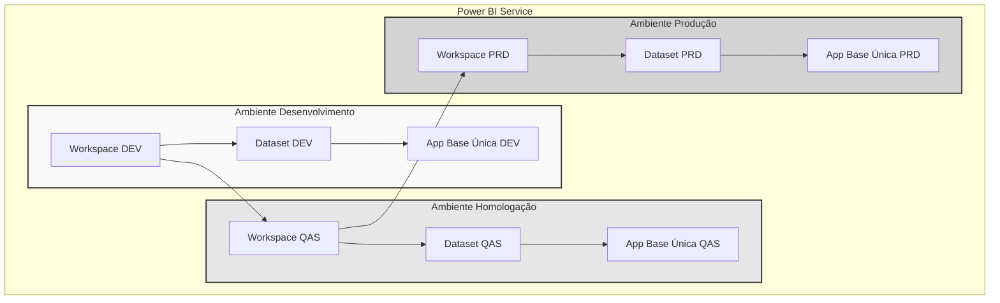
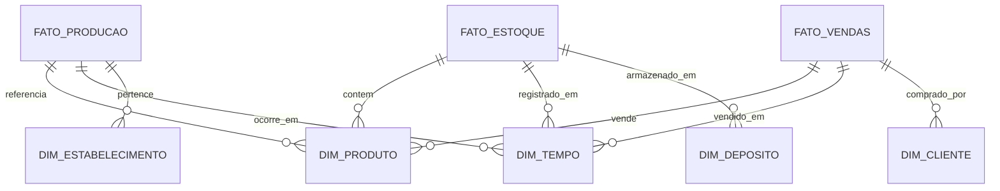

# Camada Gold - Power BI

## Visão Geral

A camada Gold representa a implementação dos modelos semânticos no Power BI, fornecendo uma camada de abstração para análise de dados através de diferentes ambientes (DEV, QAS, PRD).



## Estrutura dos Ambientes

### 1. Desenvolvimento (DEV)
- **Workspace**: NXS_BI_DEV
- **Dataset**: DS_NXS_BASE_DEV
- **App**: Base Única DEV
- **Finalidade**: 
  * Desenvolvimento de novos modelos
  * Testes de medidas e relacionamentos
  * Validação de regras de negócio

### 2. Homologação (QAS)
- **Workspace**: NXS_BI_QAS
- **Dataset**: DS_NXS_BASE_QAS
- **App**: Base Única QAS
- **Finalidade**:
  * Validação com usuários
  * Testes de performance
  * Verificação de segurança

### 3. Produção (PRD)
- **Workspace**: NXS_BI_PRD
- **Dataset**: DS_NXS_BASE_PRD
- **App**: Base Única PRD
- **Finalidade**:
  * Ambiente produtivo
  * Acesso dos usuários finais
  * Monitoramento de performance

## Modelo Semântico

### Tabelas e Relacionamentos



### Medidas DAX

#### 1. Produção
```dax
// Eficiência de Produção
Eficiencia_Producao = 
DIVIDE(
    SUM(FATO_PRODUCAO[Quantidade_Produzida]),
    SUM(FATO_PRODUCAO[Quantidade_Planejada]),
    0
)

// OEE (Overall Equipment Effectiveness)
OEE = 
VAR Disponibilidade = [Taxa_Disponibilidade]
VAR Performance = [Taxa_Performance]
VAR Qualidade = [Taxa_Qualidade]
RETURN
    Disponibilidade * Performance * Qualidade

// Tempo Médio Entre Falhas (MTBF)
MTBF = 
DIVIDE(
    [Total_Horas_Operacao],
    [Total_Paradas_Nao_Planejadas],
    0
)
```

#### 2. Vendas
```dax
// Margem de Contribuição
Margem_Contribuicao = 
VAR Receita = [Total_Receita_Liquida]
VAR Custos = [Total_Custos_Variaveis]
RETURN
    Receita - Custos

// Crescimento YoY
Crescimento_YoY = 
VAR VendaAtual = [Total_Vendas]
VAR VendaAnterior = 
    CALCULATE(
        [Total_Vendas],
        SAMEPERIODLASTYEAR(DIM_TEMPO[Data])
    )
RETURN
    DIVIDE(
        VendaAtual - VendaAnterior,
        VendaAnterior,
        BLANK()
    )
```

### Segurança (RLS)

#### Roles e Permissões
```dax
// RLS por Estabelecimento
[Estabelecimento] = 
VAR UserEmail = USERNAME()
VAR UserEstabs = VALUES(SEC_USERS[Estabelecimentos])
RETURN
    CONTAINSSTRING(
        UserEstabs,
        DIM_ESTABELECIMENTO[Codigo]
    )

// RLS por Hierarquia
[Hierarquia] =
VAR UserDept = SEC_USERS[Departamento]
VAR UserLevel = SEC_USERS[Nivel]
RETURN
    UserLevel >= DIM_HIERARQUIA[Nivel_Minimo]
```

## Processo de Desenvolvimento

### 1. Criação de Medidas
- Nomenclatura padronizada
- Comentários explicativos
- Testes de performance
- Documentação

```dax
/* 
Descrição: Calcula a eficiência de produção diária
Unidade: Percentual
Atualização: Diária
*/
[Eficiencia_Producao_Diaria] =
VAR Producao = ...
VAR Meta = ...
RETURN
    DIVIDE(Producao, Meta, 0)
```

### 2. Otimização de Performance

#### Particionamento
```json
{
    "name": "FATO_PRODUCAO",
    "partitions": [
        {
            "name": "Atual",
            "mode": "import",
            "source": {
                "type": "query",
                "query": "SELECT * FROM dw.FT_Producao WHERE Data >= DATEADD(month, -3, GETDATE())"
            }
        },
        {
            "name": "Historico",
            "mode": "import",
            "source": {
                "type": "query",
                "query": "SELECT * FROM dw.FT_Producao WHERE Data < DATEADD(month, -3, GETDATE())"
            }
        }
    ]
}
```

#### Agregações
```json
{
    "name": "AGG_Producao_Mensal",
    "source": "FATO_PRODUCAO",
    "aggregations": [
        {
            "name": "Quantidade_Produzida",
            "sourceColumn": "Quantidade_Produzida",
            "summarization": "sum"
        }
    ],
    "groupBy": ["SK_Tempo", "SK_Produto"]
}
```

## Processo de Publicação

### 1. Promoção entre Ambientes
```powershell
# Script de Publicação
$sourceWorkspace = "NXS_BI_DEV"
$targetWorkspace = "NXS_BI_QAS"
$datasetName = "DS_NXS_BASE"

# Export PBIX from DEV
Export-PowerBIReport -WorkspaceName $sourceWorkspace -ReportName $datasetName

# Import to QAS
Import-PowerBIReport -WorkspaceName $targetWorkspace -Path "$datasetName.pbix"
```

### 2. Testes de Qualidade
- Validação de medidas
- Testes de performance
- Verificação de segurança
- Conferência de dados

### 3. Documentação
- Dicionário de dados
- Catálogo de medidas
- Manual do usuário
- Registro de mudanças

## Monitoramento

### 1. Performance
```powerquery
// Query de Monitoramento
let
    Source = PowerBI.Datasources("NXS_BI_PRD"),
    Metrics = Table.SelectColumns(Source, {
        "DatasetName",
        "RefreshTime",
        "QueryTime",
        "RowCount"
    })
in
    Metrics
```

### 2. Atualização de Dados
- Logs de refresh
- Alertas de falha
- Tempo de processamento
- Volumetria

## Links Relacionados
- [Camada Silver](silver.md)
- [Publicação](publish.md)
- [Governança](../nxs-governance-pbi.md)