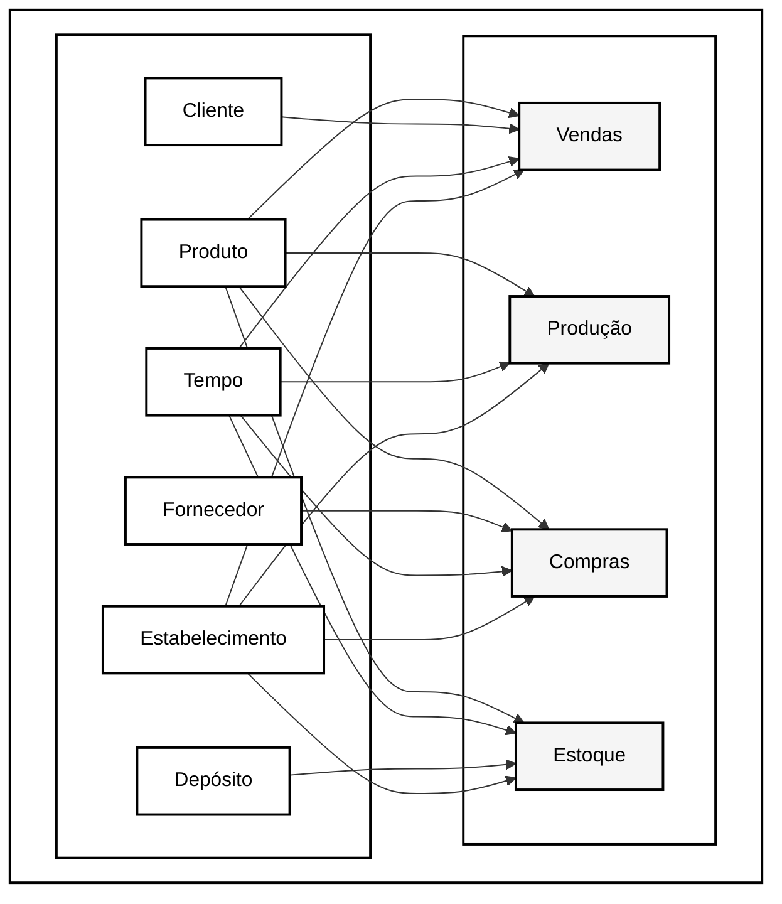

# Camada Silver - Data Warehouse

## Visão Geral

A camada Silver implementa o modelo dimensional (Star Schema) do Data Warehouse, transformando os dados brutos da camada Bronze em estruturas otimizadas para análise.

## Estrutura Dimensional

### Dimensões Principais

[Previous content of the file including all SQL and documentation]

## Links Relacionados
- [Camada Bronze](bronze.md)
- [Camada Gold](gold.md)
- [Governança](../governance.md)