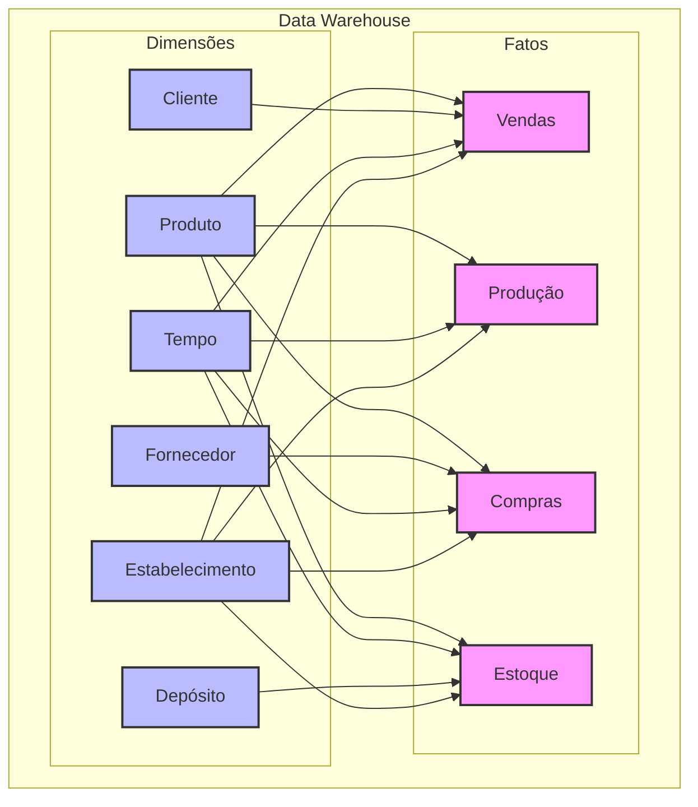

# Camada Silver - Data Warehouse

## Visão Geral

A camada Silver implementa o modelo dimensional (Star Schema) do Data Warehouse, transformando os dados brutos da camada Bronze em estruturas otimizadas para análise.



## Estrutura Dimensional

### Dimensões Principais

#### 1. Produto (DIM_Produto)
```sql
CREATE TABLE dw.DIM_Produto (
    SK_Produto INT IDENTITY(1,1),
    NK_Produto VARCHAR(20),      -- Natural Key do Datasul
    Codigo_Produto VARCHAR(20),
    Descricao_Produto VARCHAR(100),
    Tipo_Produto VARCHAR(50),
    Grupo_Produto VARCHAR(50),
    Subgrupo_Produto VARCHAR(50),
    Unidade_Medida VARCHAR(10),
    Peso_Liquido DECIMAL(18,4),
    Peso_Bruto DECIMAL(18,4),
    Status_Produto VARCHAR(20),
    Data_Cadastro DATE,
    Data_Ultima_Compra DATE,
    Data_Ultima_Venda DATE,
    Flag_Ativo BIT,
    Data_Inicio_Vigencia DATETIME,
    Data_Fim_Vigencia DATETIME,
    Versao_Atual BIT,
    CONSTRAINT PK_DIM_Produto PRIMARY KEY (SK_Produto)
);
```

#### 2. Tempo (DIM_Tempo)
```sql
CREATE TABLE dw.DIM_Tempo (
    SK_Tempo INT,               -- YYYYMMDD
    Data DATE,
    Ano INT,
    Semestre INT,
    Trimestre INT,
    Mes INT,
    Nome_Mes VARCHAR(20),
    Semana_Ano INT,
    Dia_Semana INT,
    Nome_Dia_Semana VARCHAR(20),
    Dia_Util BIT,
    Feriado BIT,
    Nome_Feriado VARCHAR(50),
    CONSTRAINT PK_DIM_Tempo PRIMARY KEY (SK_Tempo)
);
```

### Fatos

#### 1. Produção (FT_Producao)
```sql
CREATE TABLE dw.FT_Producao (
    SK_Producao BIGINT IDENTITY(1,1),
    SK_Produto INT,
    SK_Tempo INT,
    SK_Estabelecimento INT,
    NK_Ordem_Producao INT,
    Quantidade_Planejada DECIMAL(18,4),
    Quantidade_Produzida DECIMAL(18,4),
    Quantidade_Refugada DECIMAL(18,4),
    Tempo_Planejado DECIMAL(18,2),
    Tempo_Realizado DECIMAL(18,2),
    Custo_Planejado DECIMAL(18,2),
    Custo_Realizado DECIMAL(18,2),
    Flag_Ordem_Encerrada BIT,
    CONSTRAINT PK_FT_Producao PRIMARY KEY (SK_Producao),
    CONSTRAINT FK_FT_Producao_Produto FOREIGN KEY (SK_Produto) 
        REFERENCES dw.DIM_Produto (SK_Produto),
    CONSTRAINT FK_FT_Producao_Tempo FOREIGN KEY (SK_Tempo) 
        REFERENCES dw.DIM_Tempo (SK_Tempo),
    CONSTRAINT FK_FT_Producao_Estabelecimento FOREIGN KEY (SK_Estabelecimento)
        REFERENCES dw.DIM_Estabelecimento (SK_Estabelecimento)
);
```

## Processo ETL

### 1. Carga de Dimensões

#### Dimensão Produto
```sql
-- Exemplo de procedure de carga SCD Tipo 2
CREATE PROCEDURE dw.sp_Carga_DIM_Produto
AS
BEGIN
    -- Identificar novos registros e alterações
    WITH Changes AS (
        SELECT 
            p.cod_produto,
            p.descricao,
            p.tipo,
            p.grupo,
            p.subgrupo,
            p.unidade,
            p.peso_liquido,
            p.peso_bruto,
            p.status,
            p.data_cadastro
        FROM bronze.datasul.est_produto p
        LEFT JOIN dw.DIM_Produto d 
            ON p.cod_produto = d.NK_Produto 
            AND d.Versao_Atual = 1
        WHERE d.SK_Produto IS NULL 
            OR p.descricao <> d.Descricao_Produto
            OR p.status <> d.Status_Produto
    )
    
    -- Atualizar registros existentes (fechar versão atual)
    UPDATE d
    SET 
        Data_Fim_Vigencia = GETDATE(),
        Versao_Atual = 0
    FROM dw.DIM_Produto d
    INNER JOIN Changes c ON d.NK_Produto = c.cod_produto
    WHERE d.Versao_Atual = 1;
    
    -- Inserir novos registros
    INSERT INTO dw.DIM_Produto (
        NK_Produto,
        Codigo_Produto,
        Descricao_Produto,
        -- ... outros campos ...
        Data_Inicio_Vigencia,
        Data_Fim_Vigencia,
        Versao_Atual
    )
    SELECT 
        cod_produto,
        cod_produto,
        descricao,
        -- ... outros campos ...
        GETDATE(),
        NULL,
        1
    FROM Changes;
END;
```

### 2. Carga de Fatos

#### Fato Produção
```sql
CREATE PROCEDURE dw.sp_Carga_FT_Producao
    @Data_Inicial DATE,
    @Data_Final DATE
AS
BEGIN
    -- Limpar período a ser recarregado
    DELETE FROM dw.FT_Producao
    WHERE SK_Tempo BETWEEN 
        CONVERT(INT, CONVERT(VARCHAR, @Data_Inicial, 112))
        AND CONVERT(INT, CONVERT(VARCHAR, @Data_Final, 112));
    
    -- Inserir dados do período
    INSERT INTO dw.FT_Producao (
        SK_Produto,
        SK_Tempo,
        SK_Estabelecimento,
        NK_Ordem_Producao,
        Quantidade_Planejada,
        Quantidade_Produzida,
        -- ... outros campos ...
    )
    SELECT 
        p.SK_Produto,
        t.SK_Tempo,
        e.SK_Estabelecimento,
        op.num_ordem,
        op.quantidade,
        SUM(m.quantidade_produzida),
        -- ... outros campos ...
    FROM bronze.datasul.mfg_ordem_producao op
    JOIN bronze.datasul.mfg_movimento m 
        ON op.num_ordem = m.num_ordem
    JOIN dw.DIM_Produto p 
        ON op.cod_produto = p.NK_Produto
        AND op.data_emissao BETWEEN p.Data_Inicio_Vigencia 
            AND ISNULL(p.Data_Fim_Vigencia, '9999-12-31')
    JOIN dw.DIM_Tempo t 
        ON CONVERT(VARCHAR, op.data_emissao, 112) = t.SK_Tempo
    JOIN dw.DIM_Estabelecimento e 
        ON op.cod_estabelecimento = e.NK_Estabelecimento
    WHERE op.data_emissao BETWEEN @Data_Inicial AND @Data_Final
    GROUP BY 
        p.SK_Produto,
        t.SK_Tempo,
        e.SK_Estabelecimento,
        op.num_ordem,
        op.quantidade;
END;
```

## Medidas Calculadas

### Produção
```sql
-- Eficiência de Produção
CREATE VIEW dw.vw_Eficiencia_Producao AS
SELECT 
    p.SK_Tempo,
    p.SK_Produto,
    p.SK_Estabelecimento,
    SUM(p.Quantidade_Produzida) / NULLIF(SUM(p.Quantidade_Planejada), 0) * 100 as Eficiencia,
    SUM(p.Quantidade_Refugada) / NULLIF(SUM(p.Quantidade_Produzida), 0) * 100 as Taxa_Refugo,
    SUM(p.Tempo_Realizado) / NULLIF(SUM(p.Tempo_Planejado), 0) * 100 as Eficiencia_Tempo
FROM dw.FT_Producao p
GROUP BY 
    p.SK_Tempo,
    p.SK_Produto,
    p.SK_Estabelecimento;
```

## Manutenção

### Política de Retenção
- Fatos: 60 meses
- Dimensões: Histórico completo
- Agregações: 24 meses

### Reconstrução de Períodos
```sql
CREATE PROCEDURE dw.sp_Reconstruir_Periodo
    @Data_Inicial DATE,
    @Data_Final DATE
AS
BEGIN
    -- Executar cargas em ordem
    EXEC dw.sp_Carga_DIM_Produto;
    EXEC dw.sp_Carga_FT_Producao @Data_Inicial, @Data_Final;
    -- ... outras cargas ...
END;
```

## Links Relacionados
- [Camada Bronze](bronze.md)
- [Camada Gold](gold.md)
- [Governança](../nxs-governance-pbi.md)