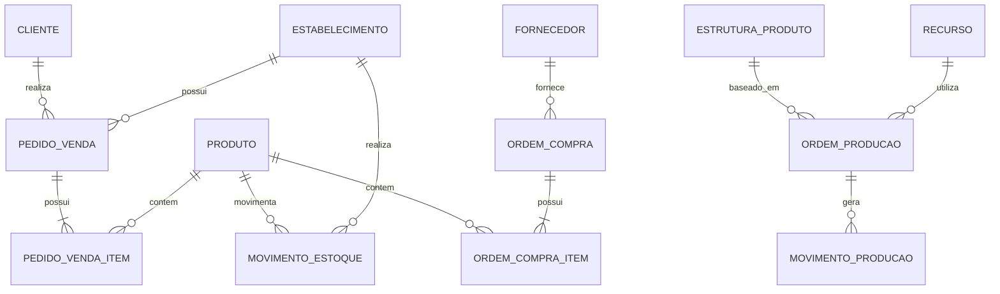
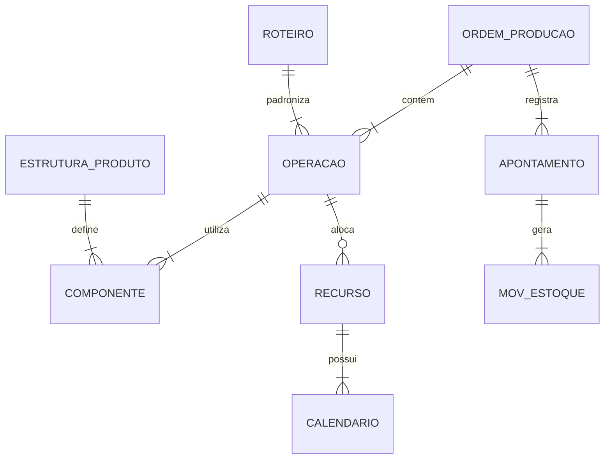

# Fontes de Dados

## Totvs Datasul ERP

### Informações Gerais
- **Versão**: Datasul 12.1.7
- **Banco de Dados**: Progress
- **Servidor**: SRV-PROGRESS-01
- **Porta**: 8080
- **Ambiente**: Produção

### Estrutura do Banco de Dados

#### Esquema de Dados Geral


### Módulos Detalhados

#### 1. Manufatura (MES)

##### 1.1 Estrutura Principal Manufatura


##### 1.2 Tabelas do Módulo Manufatura

###### Ordem de Produção (mfg-pro)
```sql
TABLE mfg-pro
    num-ord     INTEGER         /* Número da ordem */
    dat-emi     DATE           /* Data de emissão */
    cod-pro     CHARACTER       /* Código do produto */
    qtd-ord     DECIMAL        /* Quantidade da ordem */
    dat-ini     DATE           /* Data início prevista */
    dat-fim     DATE           /* Data fim prevista */
    cod-est     INTEGER         /* Status da ordem */
    cod-rot     INTEGER         /* Código do roteiro */
    num-lot     CHARACTER       /* Número do lote */
    obs-ord     CHARACTER       /* Observações */
    usr-emi     CHARACTER       /* Usuário emissor */
    dat-alt     DATE           /* Data última alteração */
    INDEX num-ord IS PRIMARY UNIQUE
    INDEX cod-pro-ord IS cod-pro
```

###### Operações de Produção (mfg-ope)
```sql
TABLE mfg-ope
    num-ord     INTEGER         /* Número da ordem */
    seq-ope     INTEGER         /* Sequência da operação */
    cod-rot     INTEGER         /* Código do roteiro */
    cod-rec     INTEGER         /* Código do recurso */
    tmp-pre     DECIMAL        /* Tempo previsto */
    tmp-rea     DECIMAL        /* Tempo realizado */
    dat-ini     DATE           /* Data início real */
    dat-fim     DATE           /* Data fim real */
    qtd-pro     DECIMAL        /* Quantidade produzida */
    qtd-ref     DECIMAL        /* Quantidade refugada */
    sta-ope     INTEGER         /* Status da operação */
    INDEX num-ord-seq IS PRIMARY UNIQUE (num-ord, seq-ope)
```

###### Recursos de Produção (mfg-rec)
```sql
TABLE mfg-rec
    cod-rec     INTEGER         /* Código do recurso */
    den-rec     CHARACTER       /* Denominação do recurso */
    tip-rec     INTEGER         /* Tipo do recurso */
    cap-hor     DECIMAL        /* Capacidade por hora */
    cen-cus     CHARACTER       /* Centro de custo */
    cal-rec     INTEGER         /* Calendário do recurso */
    dat-man     DATE           /* Data última manutenção */
    sta-rec     INTEGER         /* Status do recurso */
    INDEX cod-rec IS PRIMARY UNIQUE
```

###### Apontamentos de Produção (mfg-apt)
```sql
TABLE mfg-apt
    num-apt     INTEGER         /* Número do apontamento */
    num-ord     INTEGER         /* Número da ordem */
    seq-ope     INTEGER         /* Sequência da operação */
    dat-apt     DATE           /* Data do apontamento */
    hor-ini     INTEGER         /* Hora início */
    hor-fim     INTEGER         /* Hora fim */
    qtd-pro     DECIMAL        /* Quantidade produzida */
    qtd-ref     DECIMAL        /* Quantidade refugada */
    cod-mot     INTEGER         /* Código do motivo */
    cod-ope     CHARACTER       /* Código do operador */
    obs-apt     CHARACTER       /* Observações */
    INDEX num-apt IS PRIMARY UNIQUE
    INDEX num-ord-apt IS num-ord
```

##### 1.3 Views Principais Manufatura

###### View Consolidada de Produção (v-mfg-ord)
```sql
CREATE VIEW v-mfg-ord AS
SELECT 
    p.num-ord,
    p.dat-emi,
    p.cod-pro,
    r.den-pro AS desc-produto,
    p.qtd-ord,
    p.dat-ini,
    p.dat-fim,
    p.cod-est,
    SUM(a.qtd-pro) AS qtd-produzida,
    SUM(a.qtd-ref) AS qtd-refugada
FROM mfg-pro p
LEFT JOIN est-pro r ON p.cod-pro = r.cod-pro
LEFT JOIN mfg-apt a ON p.num-ord = a.num-ord
GROUP BY p.num-ord, p.dat-emi, p.cod-pro, r.den-pro,
         p.qtd-ord, p.dat-ini, p.dat-fim, p.cod-est
```

###### View Eficiência de Recursos (v-mfg-rec)
```sql
CREATE VIEW v-mfg-rec AS
SELECT 
    r.cod-rec,
    r.den-rec,
    o.num-ord,
    o.dat-ini,
    o.dat-fim,
    o.tmp-pre,
    o.tmp-rea,
    (o.tmp-rea / NULLIF(o.tmp-pre, 0)) * 100 AS eficiencia
FROM mfg-rec r
JOIN mfg-ope o ON r.cod-rec = o.cod-rec
```

##### 1.4 Principais Consultas de Análise

###### Eficiência de Produção por Ordem
```sql
SELECT 
    ord.num-ord,
    ord.cod-pro,
    ord.qtd-ord,
    SUM(apt.qtd-pro) as qtd_produzida,
    SUM(apt.qtd-ref) as qtd_refugada,
    (SUM(apt.qtd-pro) / ord.qtd-ord * 100) as eficiencia
FROM mfg-pro ord
LEFT JOIN mfg-apt apt ON ord.num-ord = apt.num-ord
WHERE ord.dat-emi BETWEEN ? AND ?
GROUP BY ord.num-ord, ord.cod-pro, ord.qtd-ord
```

###### Ocupação de Recursos
```sql
SELECT 
    rec.cod-rec,
    rec.den-rec,
    COUNT(DISTINCT ope.num-ord) as total_ordens,
    SUM(ope.tmp-rea) as tempo_total,
    SUM(CASE WHEN ope.sta-ope = 1 THEN 1 ELSE 0 END) as ordens_ativas
FROM mfg-rec rec
LEFT JOIN mfg-ope ope ON rec.cod-rec = ope.cod-rec
WHERE ope.dat-ini BETWEEN ? AND ?
GROUP BY rec.cod-rec, rec.den-rec
```

[Continuing in next section...]