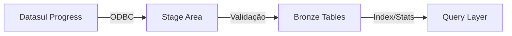

# Camada Bronze (SQL Server)

## Objetivo
Replicar os dados do Datasul em uma estrutura SQL Server otimizada para consultas.

## Características
- Estrutura normalizada
- Nomenclatura original preservada
- Dados raw (sem transformações)
- Histórico limitado (90 dias)

## Processo ETL


## Tabelas
- Prefixo: BRZ_
- Exemplo:
```sql
CREATE TABLE BRZ_TGFCAB (
    NUNOTA int,
    DTNEG datetime,
    CODPARC int,
    /* campos originais */
    ETL_DATE datetime,
    ETL_VERSION varchar(10)
);
```

## Indexação
- Índices alinhados com consultas
- Estatísticas atualizadas
- Particionamento por data

## Atualização
- Frequência: 15 minutos
- Método: Incremental
- Controle: Change tracking

## Monitoramento
- Jobs SQL Server
- Log de execução
- Alertas de falha
- Métricas de performance

## Responsáveis
- TI Infraestrutura
- DBA SQL Server
- Time BI