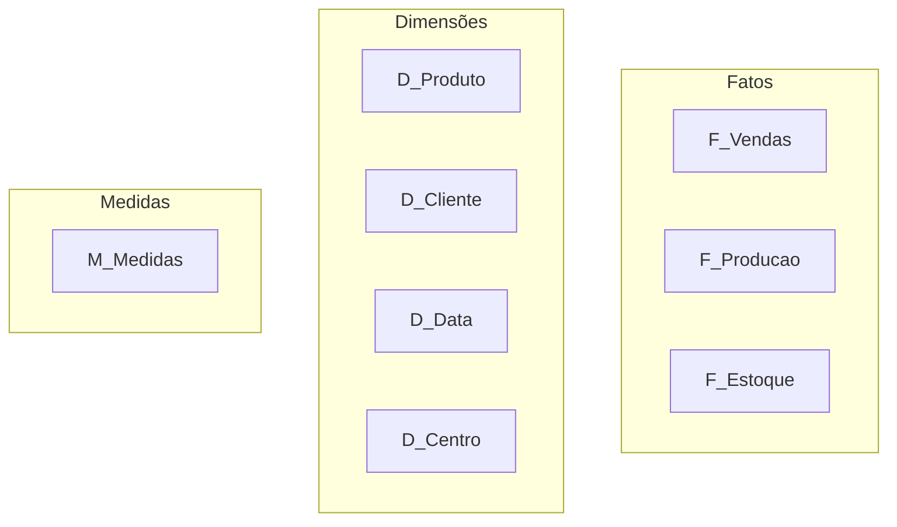

# Camada Gold (Semantic Model)

## Objetivo
Fornecer um modelo semântico unificado para análise de negócios no Power BI.

## Características
- Modelo único consolidado
- Medidas padronizadas
- Segurança implementada
- Performance otimizada

## Modelo Semântico


## Padrões de Nomenclatura
- Tabelas:
  * F_ para fatos
  * D_ para dimensões
  * M_ para medidas
- Medidas:
  * [med]NomeMedida
- Colunas calculadas:
  * [cc]NomeColuna

## Principais Medidas
```dax
// Vendas
[med]VendaBruta = 
    SUM(F_Vendas[ValorBruto])

// Produção
[med]VolumeProduzido = 
    SUM(F_Producao[Quantidade])

// Estoque
[med]DiasEstoque = 
    DIVIDE(
        [med]EstoqueAtual,
        [med]ConsumoMedioDiario
    )
```

## Performance
- Modelo Import
- Refresh incremental
- Particionamento
- Compression
- Aggregations

## Segurança
- RLS por centro
- Grupos AD/AAD
- Auditoria
- Certificação

## Responsáveis
- Time BI
- Arquiteto de Dados
- Validadores de Negócio