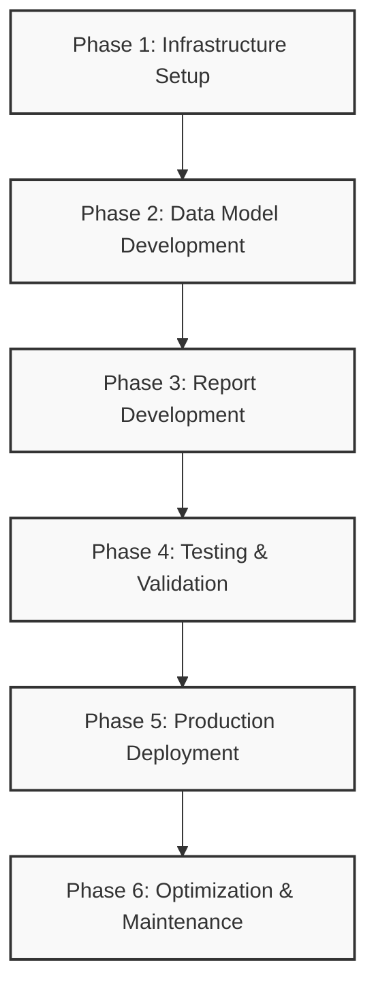
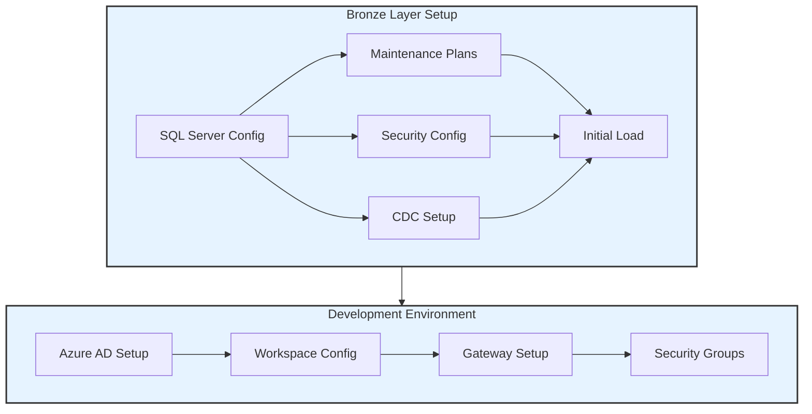
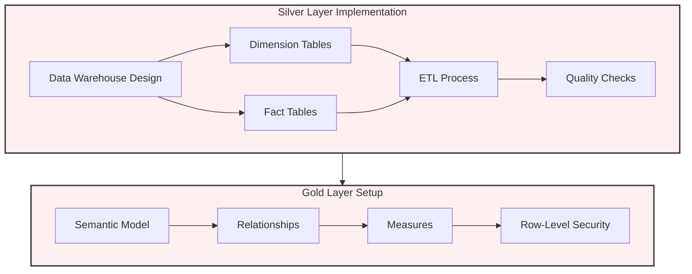
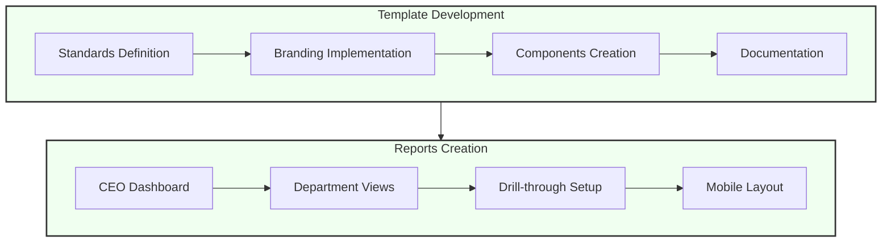
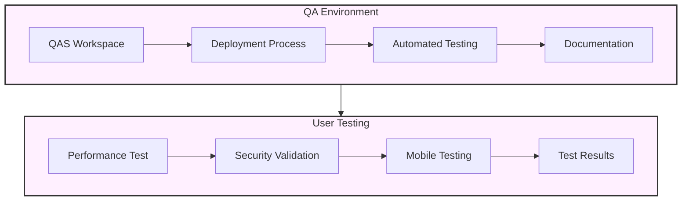
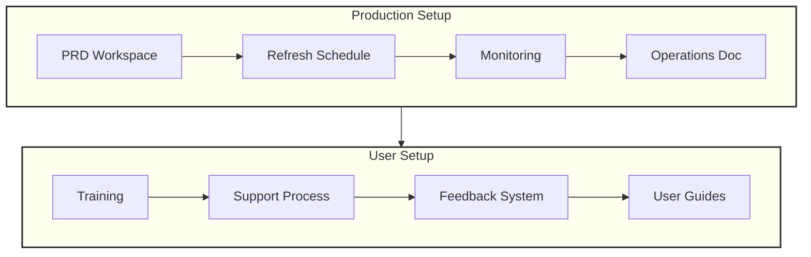
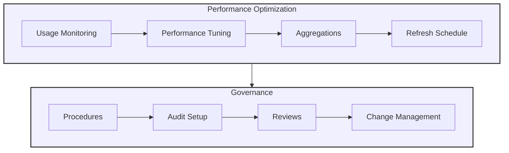

# Implementation Plan - Power BI Governance Nexus Ligas

## Project Overview

## Phase 1: Infrastructure Setup

### Bronze Layer Setup
1. SQL Server Configuration
   - Install and configure SQL Server 2019
   - Set up maintenance plans and backups
   - Configure security and access controls
   - Enable CDC (Change Data Capture)

2. Initial Data Load
   - Create database schemas
   - Implement table structures
   - Set up initial ETL processes
   - Test data replication from Datasul

### Development Environment
1. Power BI Service Configuration
   - Set up Azure AD integration
   - Configure workspaces (DEV)
   - Implement security groups
   - Set up gateway connections

## Phase 2: Data Model Development

### Silver Layer Implementation
1. Data Warehouse Design
   - Create dimensional model
   - Implement fact tables
   - Set up dimension tables
   - Configure incremental loads

2. ETL Development
   - Develop transformation procedures
   - Implement data quality checks
   - Create logging mechanisms
   - Set up monitoring

### Gold Layer Setup
1. Semantic Model Development
   - Create initial data model
   - Implement relationships
   - Develop core measures
   - Set up row-level security

## Phase 3: Report Development

1. Template Creation
   - Design standard templates
   - Implement corporate branding
   - Create reusable components
   - Document standards

2. Core Reports Development
   - Develop CEO dashboard
   - Create departmental views
   - Implement drill-through reports
   - Set up mobile layouts

## Phase 4: Testing & Validation

1. QA Environment Setup
   - Configure QAS workspace
   - Implement deployment process
   - Set up automated testing
   - Document validation procedures

2. User Acceptance Testing
   - Conduct performance testing
   - Validate security implementation
   - Test mobile accessibility
   - Document test results

## Phase 5: Production Deployment

1. Production Environment
   - Set up PRD workspace
   - Configure scheduled refreshes
   - Implement monitoring
   - Document operations procedures

2. User Onboarding
   - Conduct user training
   - Create documentation
   - Set up support processes
   - Establish feedback mechanisms

## Phase 6: Optimization & Maintenance

1. Performance Optimization
   - Monitor usage patterns
   - Optimize data models
   - Implement aggregations
   - Fine-tune refresh schedules

2. Governance Implementation
   - Document procedures
   - Implement audit processes
   - Set up regular reviews
   - Establish change management