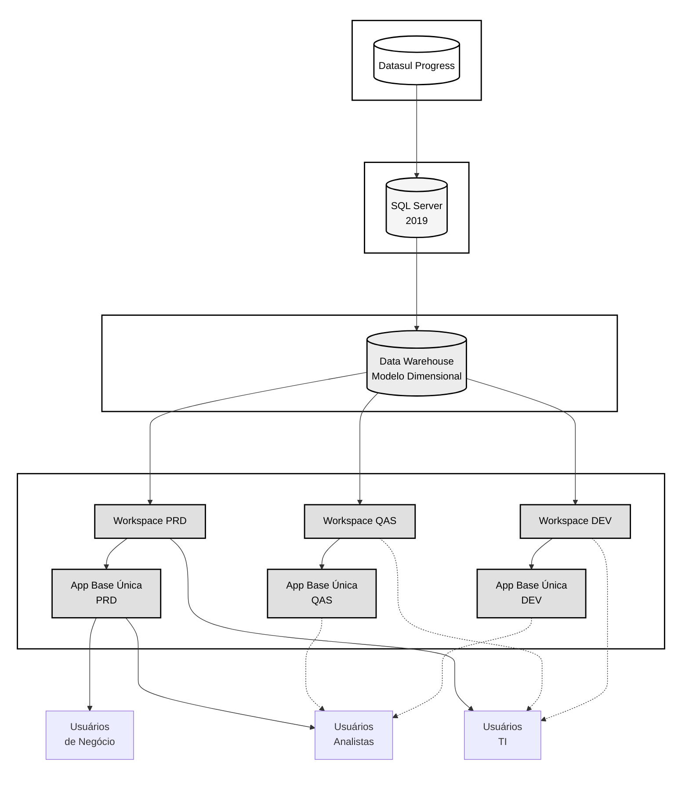

# Nexus Ligas - Governança Power BI

[Previous content until the Mermaid diagram...]

```mermaid
flowchart TD
    %% High contrast light theme for better visibility
    classDef source fill:#ffffff,stroke:#000000,stroke-width:2px,color:#000000
    classDef bronze fill:#f5f5f5,stroke:#000000,stroke-width:2px,color:#000000
    classDef silver fill:#ececec,stroke:#000000,stroke-width:2px,color:#000000
    classDef gold fill:#e0e0e0,stroke:#000000,stroke-width:2px,color:#000000
    classDef publish fill:#d3d3d3,stroke:#000000,stroke-width:2px,color:#000000
    classDef users fill:#c0c0c0,stroke:#000000,stroke-width:2px,color:#000000
    classDef env fill:none,stroke:#000000,stroke-width:2px,color:#ffffff

    subgraph Fonte["Fonte de Dados"]
        subgraph ProgressServer["Progress Server\nSRV-PROGRESS-01"]
            DS[(Datasul Progress)]
        end
        class DS source
        class ProgressServer env
    end

    subgraph Bronze["Camada Bronze"]
        subgraph WindowsServer["Windows Server\nSRV-SQLSERVER-01"]
            SQLServer[(SQL Server\n2019)]
        end
        class SQLServer bronze
        class WindowsServer env
        DS --> SQLServer
    end

    subgraph Silver["Camada Silver"]
        subgraph SilverLocation["Location: TBD"]
            DW[("Data Warehouse\nModelo Dimensional")]
        end
        class DW silver
        class SilverLocation env
        SQLServer --> DW
    end

    subgraph Gold["Camada Gold"]
        subgraph PBIService["Power BI Service"]
            subgraph DEV["Ambiente DEV"]
                WS_DEV["Workspace DEV"]
                APP_DEV["App Base Única\nDEV"]
                WS_DEV --> APP_DEV
            end
            
            subgraph QAS["Ambiente QAS"]
                WS_QAS["Workspace QAS"]
                APP_QAS["App Base Única\nQAS"]
                WS_QAS --> APP_QAS
            end
            
            subgraph PRD["Ambiente PRD"]
                WS_PRD["Workspace PRD"]
                APP_PRD["App Base Única\nPRD"]
                WS_PRD --> APP_PRD
            end
        end
        class WS_DEV,APP_DEV,WS_QAS,APP_QAS,WS_PRD,APP_PRD gold
        class PBIService env
        DW --> WS_DEV
        DW --> WS_QAS
        DW --> WS_PRD
    end

    subgraph Usuarios["Usuários"]
        UN["Usuários\nde Negócio"]
        UA["Usuários\nAnalistas"]
        UT["Usuários\nTI"]
        APP_PRD --> UN
        APP_PRD --> UA
        WS_PRD --> UT
        APP_QAS -.-> UA
        WS_QAS -.-> UT
        APP_DEV -.-> UA
        WS_DEV -.-> UT
    end

    %% Style for subgraph titles
    classDef subgraphStyle fill:none,stroke:none,color:#ffffff
    class Fonte,Bronze,Silver,Gold,Publicacao,Usuarios,DEV,QAS,PRD subgraphStyle
```

[Rest of the previous content remains the same...]