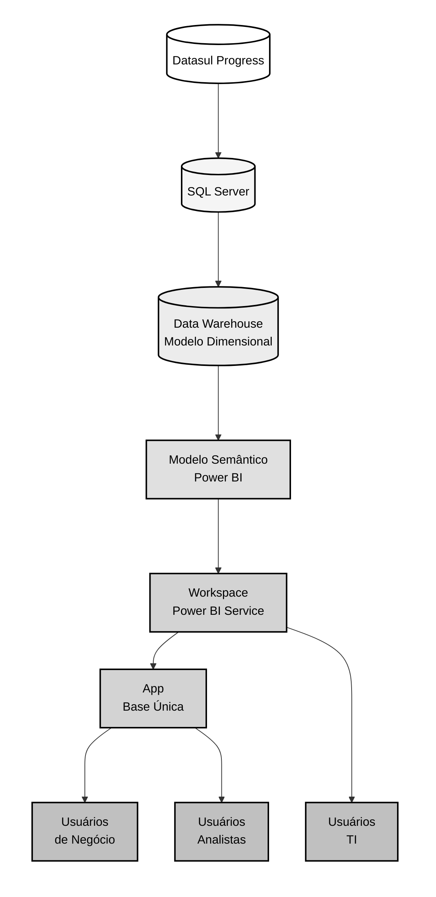

# Nexus Ligas - Governança Power BI

## Sumário da Documentação

- [Arquitetura de Dados](architecture/README.md)
  - [Fonte de Dados](source.md)
  - [Camada Bronze](bronze.md)
  - [Camada Silver](silver.md)
  - [Camada Gold](gold.md)
  - [Publicação](publish.md)
- [Requisitos](requirements/README.md)
- [User Stories](user%20stories/README.md)

## Arquitetura de Dados

[Rest of the file content remains the same...]