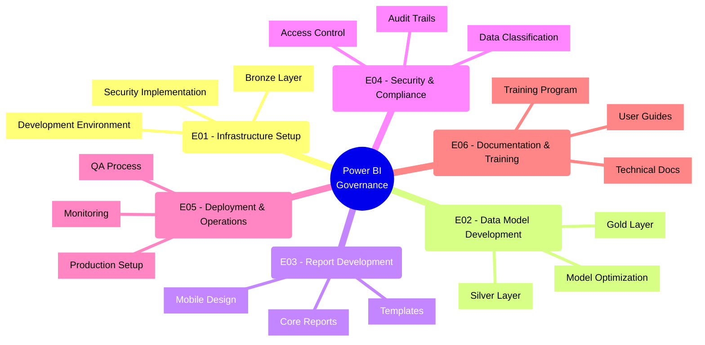
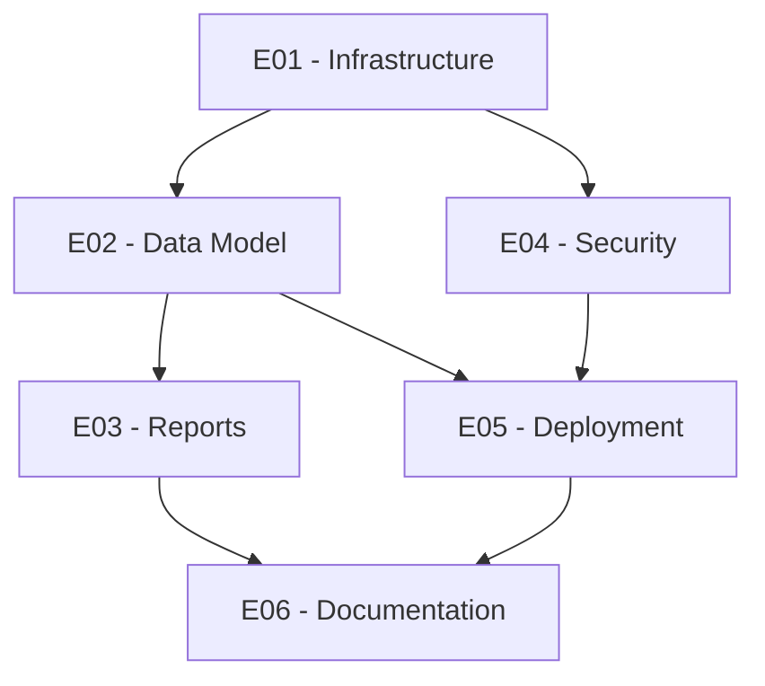

# Product Backlog - Power BI Governance Nexus

## Epics Overview

## Epic Details

### E01 - Infrastructure Setup
Priority: High
Status: In Progress

#### User Stories
- [x] US001 - SQL Server Installation
  - Install and configure SQL Server 2019
  - Set up maintenance plans
  - Configure backup procedures
  
- [ ] US002 - CDC Implementation
  - Enable CDC on source databases
  - Configure change tracking
  - Set up monitoring
  
- [ ] US003 - Development Workspace Setup
  - Create DEV workspace
  - Configure security groups
  - Set up gateway connection

- [ ] US004 - Security Framework Implementation
  - Configure Azure AD integration
  - Set up row-level security
  - Implement audit logging

### E02 - Data Model Development
Priority: High
Status: Not Started

#### User Stories
- [ ] US005 - Silver Layer Development
  - Create dimensional model
  - Implement fact tables
  - Set up ETL processes

- [ ] US006 - Gold Layer Implementation
  - Design semantic model
  - Create relationships
  - Develop key measures

- [ ] US007 - Performance Optimization
  - Configure aggregations
  - Implement partitioning
  - Optimize refresh schedules

### E03 - Report Development
Priority: Medium
Status: Not Started

#### User Stories
- [ ] US008 - Template Creation
  - Design corporate template
  - Create component library
  - Document standards

- [ ] US009 - Core Reports
  - Develop CEO dashboard
  - Create departmental views
  - Implement drill-through

### E04 - Security & Compliance
Priority: High
Status: Not Started

#### User Stories
- [ ] US010 - Access Control Implementation
  - Define security roles
  - Configure permissions
  - Set up approval process

- [ ] US011 - Audit System
  - Implement audit logging
  - Create audit reports
  - Set up alerts

### E05 - Deployment & Operations
Priority: Medium
Status: Not Started

#### User Stories
- [ ] US012 - QA Process Setup
  - Create QA workspace
  - Define validation procedures
  - Implement automated testing

- [ ] US013 - Production Environment
  - Set up PRD workspace
  - Configure scheduled refreshes
  - Implement monitoring

### E06 - Documentation & Training
Priority: Medium
Status: In Progress

#### User Stories
- [ ] US014 - Technical Documentation
  - Create architecture docs
  - Document procedures
  - Maintain development standards

- [ ] US015 - User Training Program
  - Develop training materials
  - Create user guides
  - Schedule training sessions

## Prioritization Matrix

### High Priority (Must Have)
- Infrastructure Setup (E01)
- Data Model Development (E02)
- Security & Compliance (E04)

### Medium Priority (Should Have)
- Report Development (E03)
- Deployment & Operations (E05)
- Documentation & Training (E06)

### Low Priority (Nice to Have)
- Additional visualizations
- Advanced analytics features
- Custom connectors

## Dependencies

## Success Criteria

### Technical Success
- All environments operational
- Data refresh within SLA
- Security controls validated
- Performance metrics met

### Business Success
- User adoption targets met
- Report usage metrics achieved
- Positive user feedback
- Business KPIs tracked

## Risk Register

### Technical Risks
- Data volume impacts
- Performance bottlenecks
- Integration issues

### Business Risks
- Resource availability
- User adoption
- Timeline constraints

## Monitoring & KPIs

### Performance Metrics
- Data refresh times
- Report loading speed
- System availability

### Usage Metrics
- Active users
- Report views
- Data accuracy

## Change Log

| Date       | Version | Changes                          |
|------------|---------|----------------------------------|
| 2024-01-08 | 1.0     | Initial backlog creation        |
| 2024-01-08 | 1.1     | Added detailed user stories     |
| 2024-01-08 | 1.2     | Added success criteria and KPIs |