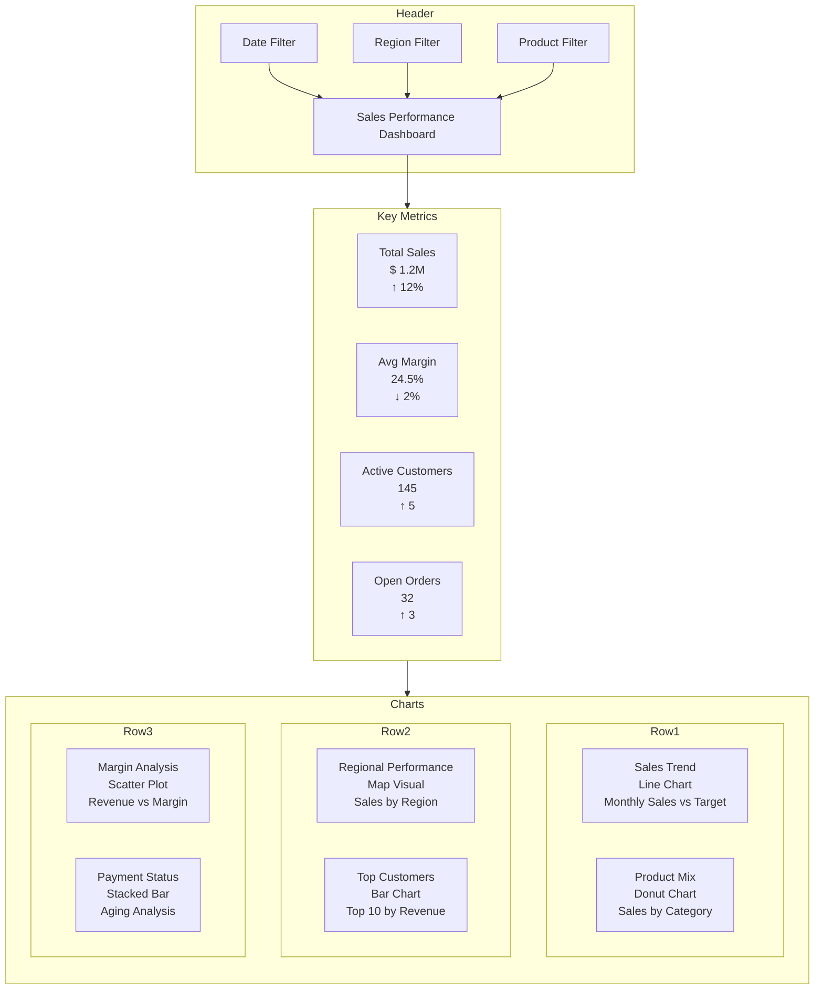
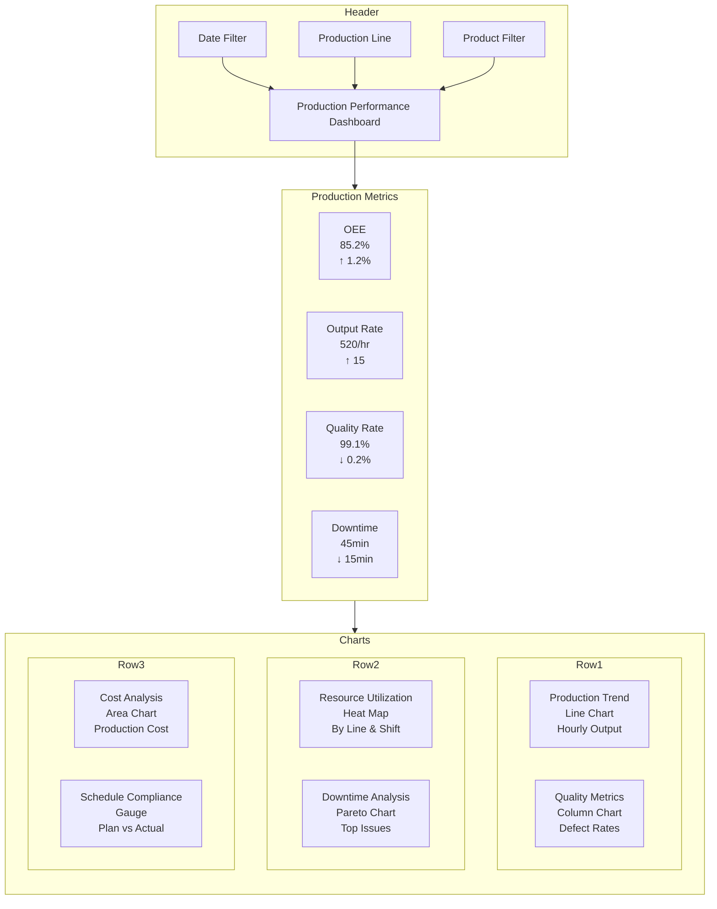
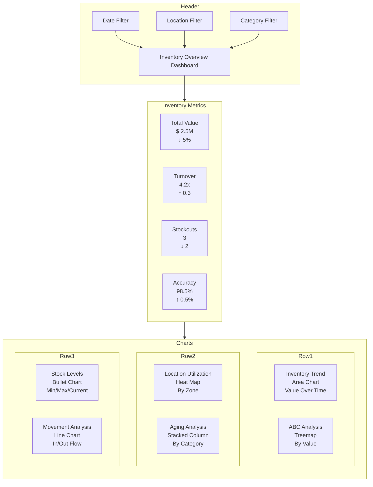

# Dashboard Mockups - Power BI Governance Nexus

## Sales Performance Dashboard

## Production Performance Dashboard

## Inventory Overview Dashboard

## Common Features Across Dashboards

### Navigation & Interactivity
- Consistent header with filters
- Drill-down capabilities on all charts
- Tool tips with detailed information
- Bookmark support for saved views
- Cross-filtering enabled

### Visual Elements
- Corporate color scheme:
  * Primary: #9932cc (Purple)
  * Secondary: #ffa500 (Orange)
  * Accent: #4a90e2 (Blue)
- Consistent font hierarchy:
  * Title: Segoe UI, 24px
  * Subtitles: Segoe UI, 18px
  * Body: Segoe UI, 12px
- Icon set for status indicators:
  * ↑ - Improvement
  * ↓ - Decline
  * → - No change

### Mobile Optimization
- KPI section always visible
- Scrollable chart section
- Touch-optimized filter pane
- Responsive chart sizing

### Drill-Through Options
- From Sales to Customer Details
- From Production to Line Details
- From Inventory to Item Details

## Implementation Notes

### Data Refresh
- Sales: 15-minute intervals
- Production: 5-minute intervals
- Inventory: Hourly updates

### Performance Targets
- Page load: < 3 seconds
- Filter response: < 1 second
- Drill-through: < 2 seconds

### Security Requirements
- Row-level security by:
  * Region (Sales)
  * Production Line
  * Warehouse Location