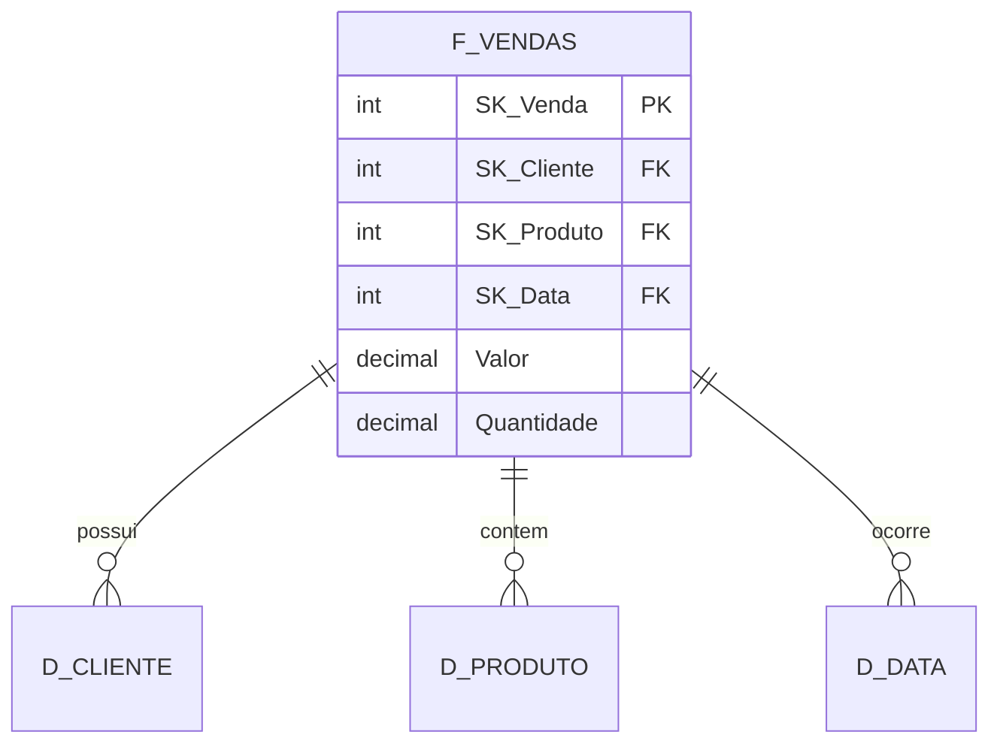

# Camada Silver (Data Warehouse)

## Objetivo
Transformar dados brutos em um modelo dimensional otimizado para análise.

## Características
- Modelo estrela/snowflake
- Dados transformados
- Histórico completo
- Regras de negócio aplicadas

## Modelo Dimensional

## Tabelas
- Prefixo: F_ (Fatos) e D_ (Dimensões)
- Padrão de nomenclatura português
- Chaves substitutas (SK)
- Controle de versão (SCD)

## Transformações
- Limpeza de dados
- Padronização de unidades
- Conversão de moedas
- Cálculos derivados

## Atualização
- Frequência: 1 hora
- Método: Merge
- Controle: CDC

## Qualidade
- Regras de validação
- Tratamento de nulos
- Consistência referencial
- Logs de auditoria

## Responsáveis
- Time BI
- Analistas de Dados
- Product Owner